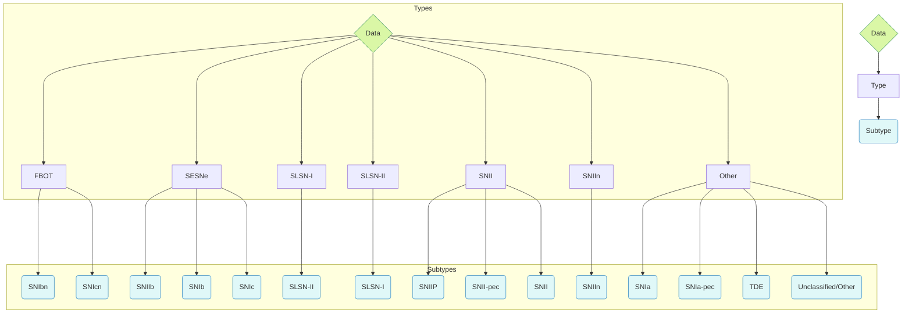

<big><center><b>GOPREAUX</b></center>
<center><i>Gaussian-process Optimized Photometric templates of REcent, Archival, and Unclassified eXplosive transients</i></center></big>
<br>
A package for multi-dimensional Gaussian Process Regression of extragalactic astronomical transient light curves, enabling a full characterization of their spectral energy distribution evolution with time. 

## Background
Time-domain astronomy is entering a golden age of discovery, powered by wide-field surveys such as Rubin Observatory's Legacy Survey of Space and Time. The wealth of data that will be produced over the coming years offers time-domain astronomers the opportunity to conduct population-level studies of different types of explosive extragalactic transients, many for the first time. However, our knowledge of the physics underpinning these explosions is lagging, and parsing the deluge of data in real time to identify interesting transients requires detailed knowledge of their time evolution.

`GOPREAUX` addresses these problems by producing multidimensional template light curve and spectral surfaces of different classes of transients for the first time. `GOPREAUX` models aggregated archival data, spanning the ultraviolet to the infrared, using Gaussian Process Regression across both phase and wavelength simultaneously. The models produce "template" time-evolving spectral energy distribution surfaces that can be used for a variety of use cases--to perform physical parameter inference, generate machine learning training sets of different transients at arbitrary phase and redshift, or identify rare and unusual transients in real time, to name a few use cases. 

## Install
Dependencies are managed using `poetry`. The recommended installation is to create a new python environment for this repo and install `poetry` within that environment. Then dependencies can be installed as easily as running `poetry install`.

## Data Structure

The above mermaid chart details the out-of-the-box organization of transient data into types and subtypes. The structure was chosen to group transients based on similar light curve and SED behavior, rather than physical characteristics such as powering mechanisms or progenitor channels.

## Code Example
```py
from caat import SN, SNModel

# Load the GP model
model = SNModel(
    surface="SESNe_SNIIb_GP_model.fits"
)

# Predict a light curve from -20 to 45 days at 5000 Angstroms
model.predict_lightcurve(-20.0, 45.0, 5000, show=False)

# Compare the prediction to real photometry from a supernova
gkg = SN(name="SN2016gkg")
model.compare_lightcurve_with_photometry(gkg, filt="V")
```

More examples can be found as Jupyter notebooks within the `examples/` directory.